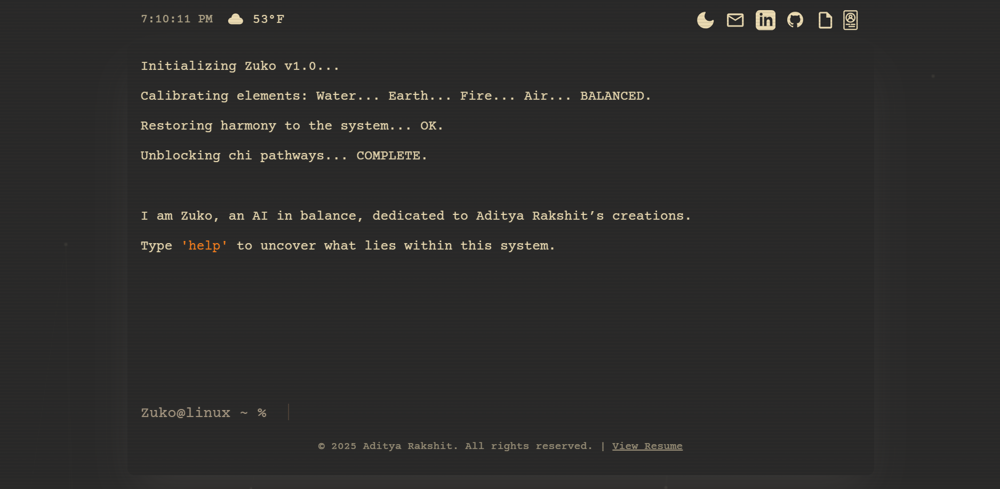

# Aditya Rakshit - Interactive AI Portfolio

Welcome to my interactive AI portfolio — a terminal-style experience powered by a custom Retrieval-Augmented Generation (RAG) pipeline. The integrated AI assistant, Zuko, uses Google Gemini 1.5 Flash and a Pinecone vector database to deliver intelligent, context-aware responses about my work, background, and projects.

---

## Key Features

* **🤖 AI-Powered Assistant — Zuko leverages Google Gemini 1.5 Flash and a Pinecone vector database through a RAG pipeline, enabling accurate, grounded responses based on my actual professional data rather than generic outputs.
* **💻 Dual Interface**: Explore the portfolio in two unique ways:
    * **Terminal View**: A retro, command-line interface where you can navigate using commands like help, projects, and skills.
    * **Standard GUI View**: A modern, visually rich layout for traditional browsing.
* **🎨 Customizable Theme**: Instantly toggle between a sleek **light mode** and a classic **dark mode**.
* **🌐 Live Data**: Real-time clock and local weather integration, dynamically fetched from your location.
* **✨ Dynamic UI**: Animated background graphics and interactive sound effects bring the interface to life.
* **📱 Fully Responsive**: Optimized for desktop, tablet, and mobile devices.

---

## How It Works: The RAG Pipeline 🧠

When you ask Zuko a question, it doesn’t simply rely on a large language model. Instead, it runs a four-step Retrieval-Augmented Generation process to ensure accurate, personalized answers:

1.  **Query Embedding**: Your question is converted into a numerical vector (an embedding).
2.  **Vector Search**: The system searches the **Pinecone** database for semantically similar pieces of data from my portfolio (experience, projects, skills, etc.).
3.  **Context Augmentation**: The retrieved information is merged with your original question to form a context-rich prompt.
4.  **LLM Generation**: This enhanced prompt is sent to **gemini-2.5-flash-lite**, which produces a detailed, relevant response grounded in that data.

This pipeline ensures that the assistant’s answers are factual, insightful, and tailored to my portfolio — making Zuko a true expert on my work.
---

## Tech Stack

* **Frontend**: HTML5, CSS3, Vanilla JavaScript
* **Styling**: Tailwind CSS
* **AI & Data Pipeline**:
    * **LLM**: Google Gemini 1.5 Flash
    * **Vector Database**: Pinecone
    * **Backend**: Vercel Serverless Functions

---

## Contact

Let's connect! You can find me on the following platforms:

* **LinkedIn:** [linkedin.com/in/Adityar18](https://www.linkedin.com/in/Adityar18/)
* **GitHub:** [github.com/DesperateEffort18](https://github.com/DesperateEffort18)
* **Email:** [Adityarakshit18@gmail.com](mailto:adityarakshit18@gmail.com)